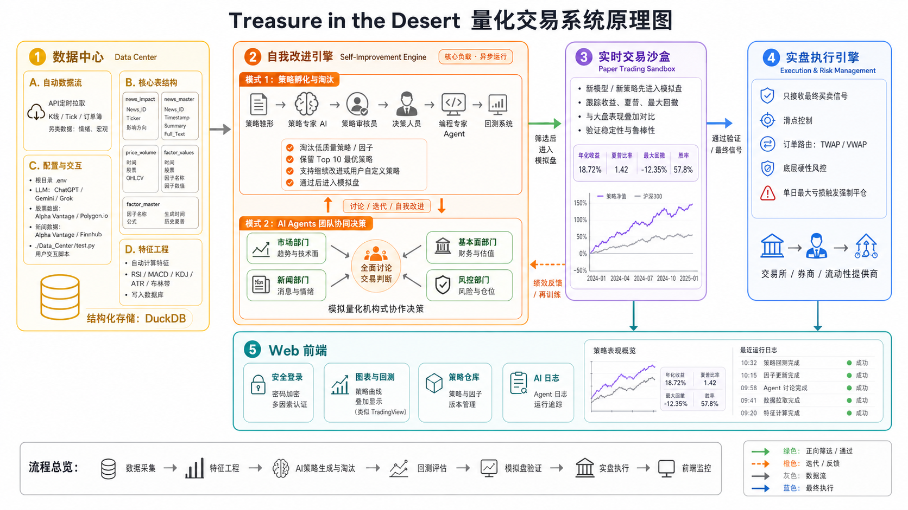
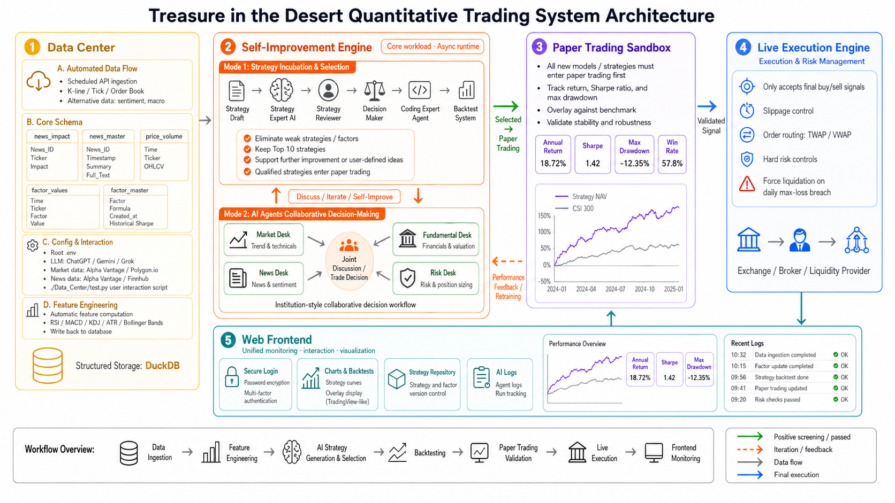

<div align="center">

# 沙海拾金
### Treasure in the Desert


**在市场的沙海里，寻找真正闪光的信号。**

**Finding signals that still shine in the desert of markets.**

Author: [Daniel Zou](https://github.com/DanielZou77) 

[Project](https://github.com/DanielZou77/Treasure-in-the-Desert/)

[中文](#中文) | [English](#english)

</div>

---

## 中文

**沙海拾金 (Treasure in the Desert)** 是一个面向量化研究、AI Agent 协作、自动化数据流、模拟盘验证与实盘风控的智能量化交易系统。

它的核心目标不是简单堆叠指标，而是建立一个可以持续采集数据、生成策略、验证表现、淘汰弱策略并沉淀优秀交易逻辑的闭环工作站。

> 由于本项目凝聚了我大量心血，当前我只决定开放 **Data Center** 部分代码。后续模块是否开放，将根据项目进展与作者计划决定。

### 🧭 原理图




### ✨ 核心模块

| 模块 | 职责 |
| --- | --- |
| 📦 Data Center | 自动采集、清洗并存储行情、新闻、情绪与因子数据 |
| 🧠 Self_Improvement Engine | 由 AI Agent 生成、讨论、审核、开发和淘汰策略 |
| 🧪 Paper Trading Sandbox | 所有新策略先进入模拟盘，跟踪夏普、回撤、胜率等指标 |
| 🛡️ Execution & Risk Management | 接收最终信号，执行订单并进行底层硬风控 |
| 🖥️ Web Frontend | 展示回测、策略仓库、AI 日志、模拟盘和风控状态 |

### 📦 Data Center

Data Center 是当前开放的核心模块，为整个系统提供结构化、可复用的数据基础。

它计划定时通过 API 拉取：

- K线、Tick 数据与订单簿快照
- 新闻、情绪指标与宏观数据
- 不同 provider 的股票与新闻数据
- 新数据到达后自动计算的技术指标和统计特征

不同 API 提供商的数据结构可能不同，因此项目将 provider 适配、数据清洗、入库逻辑拆分为独立模块，避免后续系统重复编写冗余代码。

### 🗃️ 数据表设计

| 表名 | 作用 |
| --- | --- |
| `news_impact` | 记录新闻对不同股票的影响方向：1 看涨，0 中立，-1 看跌 |
| `news_master` | 保存新闻时间、AI 摘要与原始新闻内容 |
| `price_volume` | 保存标准 OHLCV 量价数据 |
| `factor_values` | 以长表形式保存动态因子数值 |
| `factor_master` | 记录 AI 或研究流程产生的因子公式、生成时间与历史夏普 |

### 🔑 环境配置

根目录 `.env` 用于保存 API key，分为三类：

- LLM：ChatGPT、Gemini、Grok 等
- 股票数据：Alpha Vantage、Polygon.io、Twelve Data、Finnhub 等
- 新闻数据：Alpha Vantage、Finnhub、Marketaux、NewsAPI 等

### 🧪 当前验证入口

`Data_Center/test.py` 是当前阶段的轻量交互验证脚本，用于：

- 选择 API 提供商
- 检查 API key 是否可用
- 拉取并入库股票行情
- 拉取并入库新闻数据
- 打印五张核心表
- 触发基础特征工程流水线

#### 本地运行

出于仓库体积考虑，项目不会上传 `.venv` 文件夹。建议使用 **Python 3.14.3** 在本地新建虚拟隔离环境，避免和本机已有 Python 包发生版本冲突。

```powershell
py -3.14 -m venv .venv
.\.venv\Scripts\activate
python -m pip install -r requirements.txt
```

如果你的系统没有 `py` 启动器，也可以直接使用已经安装好的 Python 3.14.3：

```powershell
python -m venv .venv
```

运行前先复制 `.env.example` 为 `.env`，再填入需要使用的 API key。随后在虚拟环境中启动测试台：

```powershell
python .\Data_Center\test.py
```

如果只是想检查本地数据管道是否能跑通，可以先执行：

```powershell
python .\Data_Center\test.py --self-test
```

### 📈 特征工程流水线

新行情数据到达后，系统会自动计算并写入基础特征，例如：

`RSI`、`MACD`、`KDJ`、`ATR`、布林带、OBV、均线、波动率、动量、收益率与对数收益率。

这些特征既可服务传统策略，也可作为 AI Agent 挖掘新因子的原料。

### 🧠 Self_Improvement Engine

这是未来系统的核心负载，完全异步运行，负责“想策略”和“淘汰策略”。

**模式 1：策略流水线**

AI Agent 团队会围绕策略雏形进行分析、讨论和审核。通过后由编程专家 Agent 开发代码，再交给回测系统评估。表现差的策略或因子会被淘汰，系统保留表现最好的 10 个候选，并继续迭代或建议进入模拟盘。

**模式 2：机构式多部门决策**

系统模拟量化机构内部协作，由市场、新闻、基本面、风控、交易决策等 Agent 共同讨论市场状态并形成交易判断。

### 🧪 Paper Trading Sandbox

所有新策略都必须先进入模拟盘。系统会实时跟踪：

- 夏普比率
- 最大回撤
- 胜率与盈亏比
- 策略净值曲线
- 与大盘表现的叠加对比

### 🛡️ Execution & Risk Management

实盘执行引擎保持极简、高稳定性，只负责接收最终交易信号并可靠执行。

核心能力包括滑点控制、订单路由、TWAP/VWAP、单日最大亏损控制和极端情况下强制平仓。

### 🖥️ Web Frontend

计划中的前端将提供：

- 用户密码登录与安全加密
- 类 TradingView 的策略图表与叠加展示
- 策略仓库管理
- AI 日志系统
- 模拟盘表现看板
- 实盘风控状态监控

### 📌 当前开放范围

当前仓库仅开放 Data Center 相关代码，包括数据库结构、数据清洗、provider 适配、行情/新闻入库、基础特征工程与验证入口。

Self_Improvement Engine、Paper Trading Sandbox、Execution & Risk Management、Web Frontend 暂未完整开放。

### ⚠️ 风险提示

本项目仅用于量化研究、工程实验与系统架构探索，不构成任何投资建议。金融市场存在风险，任何自动化交易系统在实盘前都应经过严格测试、审计与风控。

---

## English

**Treasure in the Desert** is an intelligent quantitative trading system designed around AI agents, automated data pipelines, feature engineering, paper trading validation, and execution-level risk control.

Its goal is not to simply stack indicators. The project aims to build a closed-loop workstation that continuously collects data, generates ideas, validates strategies, eliminates weak candidates, and preserves robust trading logic.

> Because this project represents a significant amount of the author's effort, only the **Data Center** code is currently open sourced. Other modules may be released later depending on the project's progress and the author's plans.

### 🧭 Architecture Diagram




### ✨ Core Modules

| Module | Responsibility |
| --- | --- |
| 📦 Data Center | Collect, clean, normalize, and store market, news, sentiment, and factor data |
| 🧠 Self_Improvement Engine | Let AI agents generate, debate, review, implement, and eliminate strategies |
| 🧪 Paper Trading Sandbox | Validate every new strategy before live deployment |
| 🛡️ Execution & Risk Management | Execute final signals with strict low-level risk controls |
| 🖥️ Web Frontend | Visualize backtests, strategy repositories, AI logs, paper trading, and risk states |

### 📦 Data Center

The Data Center is the currently open core module. It provides structured and reusable data for the entire system.

It is designed to periodically fetch:

- Candlestick, tick, and order book data
- News, sentiment, and macro data
- Stock and news data from different providers
- Technical indicators and statistical features after new data arrives

Since different API providers may require different credentials and return different structures, provider adapters, cleaning logic, and ingestion logic are separated into reusable modules.

### 🗃️ Database Design

| Table | Purpose |
| --- | --- |
| `news_impact` | Stores the directional impact of news on tickers: 1 bullish, 0 neutral, -1 bearish |
| `news_master` | Stores timestamps, AI summaries, and original news content |
| `price_volume` | Stores standard OHLCV market data |
| `factor_values` | Stores dynamic factor values in long-table format |
| `factor_master` | Stores factor formulas, generation time, and historical Sharpe ratios |

### 🔑 Environment Configuration

The root `.env` file stores API keys in three groups:

- LLM providers: ChatGPT, Gemini, Grok, etc.
- Stock data providers: Alpha Vantage, Polygon.io, Twelve Data, Finnhub, etc.
- News data providers: Alpha Vantage, Finnhub, Marketaux, NewsAPI, etc.

### 🧪 Current Test Entry

`Data_Center/test.py` is a lightweight interactive validation entry for the current stage. It supports:

- API provider selection
- API key availability checks
- Stock data retrieval and ingestion
- News data retrieval and ingestion
- Formatted printing of the five core tables
- Basic feature engineering after new data arrives

#### How to Run

The repository does not include the `.venv` folder to keep its size small. Please create a local virtual environment with **Python 3.14.3** to avoid dependency conflicts with packages already installed on your machine.

```powershell
py -3.14 -m venv .venv
.\.venv\Scripts\activate
python -m pip install -r requirements.txt
```

If the `py` launcher is not available, use your installed Python 3.14.3 directly:

```powershell
python -m venv .venv
```

Before running the script, copy `.env.example` to `.env` and fill in the API keys you want to use. Then start the test console inside the virtual environment:

```powershell
python .\Data_Center\test.py
```

To quickly verify the local data pipeline without calling external APIs, run:

```powershell
python .\Data_Center\test.py --self-test
```

### 📈 Feature Engineering Pipeline

When new market data arrives, the system automatically calculates features such as:

`RSI`, `MACD`, `KDJ`, `ATR`, Bollinger Bands, OBV, moving averages, volatility, momentum, return, and log return.

These features can support traditional strategies and provide raw material for AI agents to discover new factors.

### 🧠 Self_Improvement Engine

This planned module is the core async workload of the system. It is responsible for creating and eliminating strategies.

**Mode 1: Strategy Pipeline**

AI agents analyze, debate, and review strategy outlines. Approved ideas are passed to programming agents, implemented as code, and evaluated by the backtesting system. Weak strategies are eliminated, while the top 10 candidates are preserved for further iteration or paper trading.

**Mode 2: Institution-Style Decision Making**

The system simulates a quantitative trading institution, where market, news, fundamental, risk, and trading decision agents collaborate to form trading judgments.

### 🧪 Paper Trading Sandbox

Every new strategy must enter paper trading first. The system tracks:

- Sharpe ratio
- Maximum drawdown
- Win rate and profit-loss ratio
- Strategy equity curve
- Overlay comparison with market benchmarks

### 🛡️ Execution & Risk Management

The live execution engine is designed to be minimal and stable. It only receives final signals and executes them safely.

Its responsibilities include slippage control, order routing, TWAP/VWAP execution, daily loss limits, forced liquidation, and hard risk control.

### 🖥️ Web Frontend

The planned frontend will provide:

- Secure user login
- TradingView-like strategy charts and overlays
- Strategy repository management
- AI log system
- Paper trading dashboards
- Live risk monitoring

### 📌 Current Open Scope

This repository currently opens only the Data Center code, including database schema, data cleaning, provider adapters, stock/news ingestion, basic feature engineering, and the current validation entry.

Self_Improvement Engine, Paper Trading Sandbox, Execution & Risk Management, and Web Frontend are planned modules and are not fully open sourced at this stage.

### ⚠️ Disclaimer

This project is for quantitative research, engineering experiments, and system architecture exploration only. It does not constitute investment advice. Financial markets involve risk, and any automated trading system should undergo strict testing, auditing, and risk control before live deployment.
